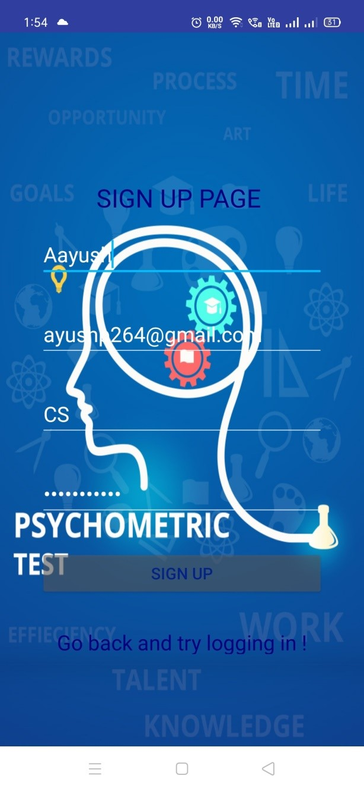
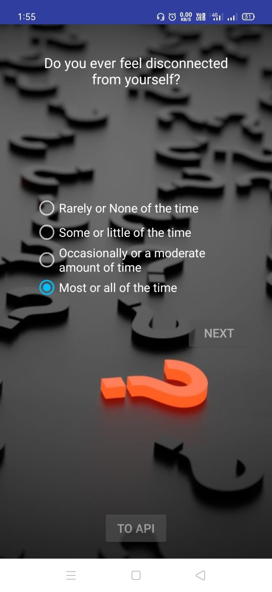
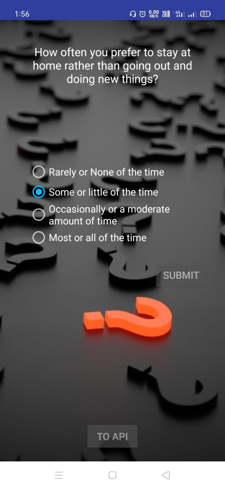

# Neo-Health-Assistant-Chatbot

Selected on the basis of our idea by the DIH (**Design & Innovation Hub**), we were provided a span of two months to complete the project.
The project involves developing an android application that would help monitor and tackle health issues such as depression in the college. It involves registering students, collecting their data in an appropriate efficient data storage system, assessing their condition through a set of questions based on phq-9 questionnaire, providing comparative analysis and also implementing a chat-bot(Neo) to further enrich the user experience.

## Technologies Involved:

### 1.**Android Studio**:
  - Android Studio IDE was used to develop this mobile application.
  - We targeted the Android Version 4.4 and above.
  - Integrates our Database Management System along with the Chat bot

### 2.**Firebase**
  - Firebase is a mobile and web application development platform that provides many services such as Analytics, storage etc.
  - Used for the authentication of users and real time database storage of data.
  - Modifications (including answers to new responses or change in user data) done offline are also updated later on when the user’s           device connects to network.

### 3.**Api.ai(Now Dialogflow)**
  - This API was used to create our Chat bot ‘Neo’. 
  - It acts as a friendly-interface between the user and the application to provide reply appropriately to the queries asked in a “natural     tone”.
  - This can be trained periodically to improve its responses. 

## Activities in Application:

## Screenshots
<table>
  <tr>
    <td>Login_Page</td>
     <td>Sign_Up_Page</td>
  </tr>
  
  <tr>
    <td></td>
    <td></td>
  </tr>
  
    <tr>
    <td>Dashboard</td>
    </tr>
  
  <tr>
    <td></td>
    <td></td>
  <tr>
    
    <tr>
     <td>Login_Page</td>
     <td>Sign_Up_Page</td>
    </tr>
  
  <tr>
    <td></td>
    <td></td>
  </tr>
</table>

Hope this may help in your project someway...!

### 
